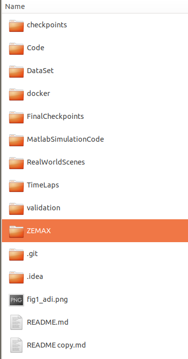

# Deep Depth-of-Field for Microscopy On-The-Go

## Downloading and building the project repository

This repository builds a  project environment in docker with Python 2.7.15 and Tensorflow 1.15.
We recommend using the docker file to ensure that all dependencies are correctly installed.

### To download and build the environment:

```bash
git clone https://github.com/VISEAONLab/microscopy_deep_dof
cd microscopy_deep_dof/
docker build -t srn-deblur-v0 docker
```

## Datasets

1. Download the available datasets from Zenodo, and unzip them.
```bash
wget https://zenodo.org/record/6822198/files/DataSet.zip?download=1
wget https://zenodo.org/record/6822198/files/RealWorldScenes.zip?download=1
unzip DataSet.zip RealWorldScenes.zip
```

this is a picture of the base folder



The base folder, microscopy_deep_dof,  should now look like this:

- In the folder ZEMAX, you can find the OpticStudio ZEMAX files for our imaging system.
- In the folder MatlabSimulationCode, you may find the related Matlab script to create the datasets. 
- All these scripts are in the subfolder CodeForDataSetCreation:
  - RunSteps - the script creates the kernels for the needed focal planes and their out-of-focus planes. To run this script, you need to be able to execute the ZEMAX optimization process.

  * MakeKernelStack - the script creates the final kernels used for deblurring the images. Each kernel is formed using the kernels in the previous step according to the procedure explained in the paper. Please note that you can find the kernels produced at the end of this stage in the folder DataSet.
  - BlurImgKernels - the script creates blurred images using the kernels produced in the previous stage and the sharp images. The sharp images are in the folder DataSet.
  - MakeTripletsForTrain - the script creates the list of the dataset used for training the srn-deblur network. The list contains the sharp images, the blurred images, and the kernels. The rest of the files in the folder are auxiliary files.
  - In the folder Code, you can find the python code for the srn-deblur network.
  - In the folder FinalCheckpoints, you can find the final checkpoints for our trained model of the network published in "Scale-recurrent Network for Deep Image Deblurring".
  - In the folder docker, you can find the docker file for setting up the environment.

## Dataset creation

The code used for creating the dataset is in Matlab.

### Creating the blurred images:

1. Open the file BlurImgKernels
2. Write the full path to the base folder (ending with the folder microscopy_deep_dof/MatlabSimulationCode/CodeForDataSetCreation).
3. Run this file.

### Preparing the dataset for the network:

1. Open the file MakeTripletsForTrain
2. Enter the same base folder (ending with microscopy_deep_dof/MatlabSimulationCode/CodeForDataSetCreation)
3. rRun the file.

## Training

1. Set up the environment
```bash
docker run --rm -it --gpus 0 -v /media/UbuntuData3/Users_Data/amitp/Projects/EdofMicrospcope/UploadToGithub/microscopy_deep_dof:/opt/project srn-deblur-v0
```
2. Run the code
```bash
cd /opt/project/
python Code/my_run_model.py - enter code lines maybe
```
## Evaluation

1. enter code lines.