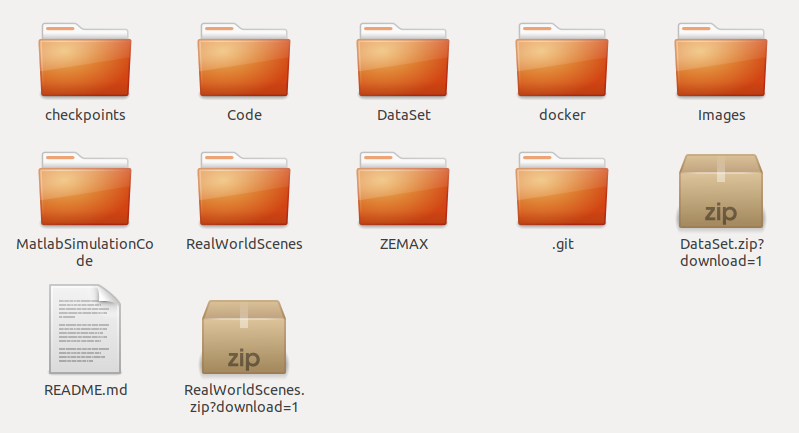

# Deep Depth-of-Field for Microscopy On-The-Go

## Installation
### Download the repository
```bash
git clone https://github.com/VISEAONLab/microscopy_deep_dof
cd microscopy_deep_dof/
```

### Docker 
We use a docker image with Tensorflow 1.15 and Python 2.7 on NVIDIA TITAN Xp.
We recommend using the docker file to ensure that all dependencies are correctly installed.

#### To build the image:
```bash
docker build -t srn-deblur docker
```

#### To enter the docker container:
Replace in the following line the phrase <'path/to/base/folder'> with your base folder name (ending with microscopy_deep_dof), and then run the command
```bash
docker run --rm -it --gpus 0 -v <'path/to/base/folder'>:/opt/project srn-deblur
```

## Datasets

### Download the available datasets from Zenodo, and unzip them:
```bash
wget https://zenodo.org/record/6822198/files/DataSet.zip?download=1
wget https://zenodo.org/record/6822198/files/RealWorldScenes.zip?download=1
unzip DataSet.zip?download=1 
unzip RealWorldScenes.zip?download=1
```


## Inference using the trained model
Run these lines inside the docker environment
```bash
python my_run_model.py --input_path '/opt/project/RealWorldScenes/Lab/OneShots' --output_path '/opt/project/test/Lab'
python my_run_model.py --input_path '/opt/project/RealWorldScenes/UnderWater/OneShots' --output_path '/opt/project/test/UnderWater'
```

### The base folder, microscopy_deep_dof,  should now look like this:



 - In the folder `Code`, you can find the python code for the srn-deblur network.
 - In the folder `DataSet`, you can find all data sets for training the network.
 - In the folder `docker`, you can find the docker file for setting up the environment.
 - In the folder `FinalCheckpoints`, you can find the final checkpoints for our trained model of the network published in "Scale-recurrent Network for Deep Image Deblurring".
 - In the folder `Images`, you can find all the available images.
- In the folder `MatlabSimulationCode`, you may find the related Matlab script to create the datasets. 
- All these scripts are in the subfolder `CodeForDataSetCreation`:
  - `RunSteps` - the script creates the kernels for the needed focal planes and their out-of-focus planes. To run this script, you need to be able to execute the ZEMAX optimization process.
  * MakeKernelStack - the script creates the final kernels used for deblurring the images. Each kernel is formed using the kernels in the previous step according to the procedure explained in the paper. Please note that you can find the kernels produced at the end of this stage in the folder DataSet.
  - BlurImgKernels - the script creates blurred images using the kernels produced in the previous stage and the sharp images. The sharp images are in the folder DataSet.
  - MakeTripletsForTrain - the script creates the list of the dataset used for training the srn-deblur network. The list contains the sharp images, the blurred images, and the kernels. 
  - The rest of the files in the folder are auxiliary files. 
 - In the folder RealWorldScenes, you can find all the scenes that were deblurred using the network.
 - In the folder ZEMAX, you can find the OpticStudio ZEMAX files for our imaging system.


## Dataset creation

### Creating the blurred images:

1. Open Matlab
2. Open the file BlurImgKernels from the folder microscopy_deep_dof/MatlabSimulationCode/CodeForDataSetCreation
3. Write the full path to the base folder (ending with microscopy_deep_dof)
4. Run the file

### Preparing the dataset for the network:

1. Open the file MakeTripletsForTrain
2. Write the same base folder (ending with microscopy_deep_dof)
3. Run the file

## Training
### Run the following code to run the network
Replace in the following line the phrase <'folder name for the run'> with your name, and then run the command inside the docker environment
```bash
python my_run_model.py --phase 'train' --expname <'folder name for the run'> --step 0
```
