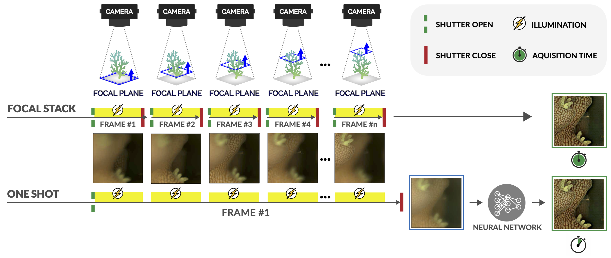

# Deep Depth-of-Field for Microscopy On-The-Go

## Below, we provide the files needed to reproduce the results published in the paper **"Deep Depth-of-Field for Microscopy On-The-Go"**.

In the folder **ZEMAX**, you can find the OpticStudio ZEMAX files for our imaging system.

In the folder **"MatlabSimulationCode"**, you can find the related Matlab script to create the datasets. All these scripts can be found in the sub folder **CodeForDataSetCreation**:
- **RunSteps** - the script creates the kernels for the needed focal planes and their out-of-focus planes.
To run this script, you need to be able to execute the ZEMAX optimization process.
- **MakeKernelStack** - the script creates the final kernels used for dublerring the images. Each kernel is formed using the kernels in the previous step according to the procedure explained in the paper.
Note that the kernels produced in this stage, can be found in the following link <zenodo link>.
- **BlurImgKernels** - the script creates blurred images using the kernels produced in the previous stage and the sharp images. The sharp images can be found in the same link as the kernels <zenodo link>.
- **MakeTripletsForTrain** - the script creates the list of the dataset used for training the srn-deblur network. The list contains the sharp images, the blurred images, and the kernels.
The rest of the files in the folder are auxiliary files.

In the folder **Code**, you can find the python code for the srn-deblur network. 

In the folder **"FinalCheckpoints"**, you can find the final checkpoints for our trained model of the network published in "Scale-recurrent Network for Deep Image Deblurring". 

In the folder **docker**, you can find the docker file for setting up the environment.

